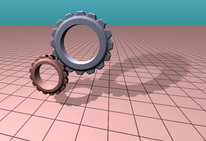

# **Rendering engineer aptitude test**
 
The task has only one goal - test base CG knowledges of a candidate before the live part of the interview.

##### Baseline data of the task

You has a renderer. The renderer draws a scene - a plane and mechanism made of two gears (webgears, you know :) ).

> ###### _<u>Note</u>: test renderer uses raymarching technique to render scene,_ 
> ###### _it doesn't mean candidate must be familiar with that technique_
> ###### _Raymarching just allows us to provide all necessary initial conditions_
> ###### _for wide variety of tasks with small code base concentrated in one shader_
> ###### _to test basic CG knowledges of candidates_

To start the renderer use command: `npm start`

Initial scene must look like on the picture: 

In the project's folder open file screen.frag - this is a shader you are going to be working with.

The task consist of two parts.

###### Part 1.

Implement an orbit camera controller that moves camera around the scene over the sphere 
depending on mouse movement. You don't need to care about event handling on CPU side - 
this solution already handles all mouse movement and pass in to shader everything you need for 
task: the camera position (uCoords) is expressed in spherical coordinates (φ, θ, r)   and
the target (uTarget) - the point where the camera must be looking at.

The test renderer raymarch a distance field along the ray RO,RD - everything you need to do in this task, 
modify the ray (RO, RD) that way that makes the camera goes around according to uCoords and uTarget values.

Find the line 173. There is a method updateCamera, 

`void updateCamera(in vec3 coord, in vec3 target, in float aspect, inout Camera camera)`

for now it doesn't do anything and this is the method you have to provide your implementation at.  

expected result:

###### Part 2.

The scene has a point light located at point (0.57703, 0.57703, -1.0).

Implements shadow casting from this light to cast shadows from the gear to the plane. 

Expected result:

 

Estimated time for whole task 30 minutes, you have an hour to feel self comfortable.

**Good luck have a fun.**

